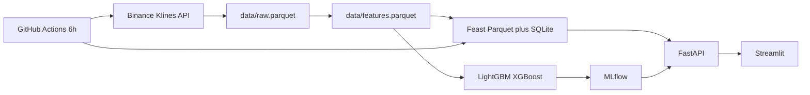

# Real-Time Crypto Volatility Forecasting System

Hourly **24h-ahead realized volatility** forecasts for **BTCUSDT, ETHUSDT, BNBUSDT, SOLUSDT**.

The full product contract — target definition, requirements, success criteria, and roadmap — is in **[docs/PLAN.md](docs/PLAN.md)**. Official walk-forward statistics are in **[docs/EVALUATION.md](docs/EVALUATION.md)**. TreeSHAP of the serving model is in **[docs/SHAP.md](docs/SHAP.md)**.

Data comes from the public Binance klines API (no API key). Features are stored in Feast, models are trained with LightGBM / XGBoost and tracked in MLflow, then served through FastAPI and a Streamlit dashboard.

Crash-risk classification is intentionally out of v1.

## Architecture



## Target

At hour `t`:

- `log_return_t = ln(close_t / close_{t-1})`
- `vol_24h = std(log_return_{t+1}, ..., log_return_{t+24})`

The dashboard also shows a 1-day equivalent: `vol_24h * sqrt(24)`.

Features at `t` never use future bars. After EDA, model inputs are scale-free: log/abs return, rolling vol 6/24/72h, vol term structure, candle range, Bollinger width/%B, RSI, SMA/EMA **ratios** (not levels), log volume, volume/trades z-scores, taker-buy ratio, shock×volume interaction, hour, day-of-week, symbol id. Raw OHLC is kept only for charts.

## Project layout

```
.
├── backend/
│   ├── app/main.py            # FastAPI
│   ├── src/                   # collect, features, train, evaluate
│   └── feature_repo/          # Feast offline Parquet + online SQLite
├── frontend/
│   └── dashboard.py           # Streamlit
├── data/                      # raw + feature parquets (gitignored binaries)
├── notebooks/                 # Colab EDA + training
├── models/                    # serving bundle
├── tests/
├── dvc.yaml
└── .github/workflows/mlops_pipeline.yml
```

## Local setup

Python 3.10+ recommended.

```bash
python -m venv .venv
.venv\Scripts\activate          # Windows
# source .venv/bin/activate     # macOS / Linux

pip install -r requirements.txt
copy .env.example .env          # Windows
# cp .env.example .env
```

### 1. Fetch data (~18 months, 4 majors)

```bash
python -m backend.src.data_collection
```

Incremental updates (used by CI):

```bash
python -m backend.src.data_collection --incremental
```

If Binance is unreachable, use any hourly OHLCV CSV with columns `open_time,open,high,low,close,volume,symbol`, convert it to `data/raw.parquet`, and continue.

### 2. EDA (one notebook only)

Open and run [notebooks/01_eda.ipynb](notebooks/01_eda.ipynb) in Colab. That file is the full EDA. Then:

```bash
python -m backend.src.eda_feature_eng
```

### 3. Feast (optional locally; parquet fallback always works)

```bash
python -m backend.feature_repo.features
```

### 4. Train + evaluate (Colab)

Run [notebooks/02_train.ipynb](notebooks/02_train.ipynb) in Colab (upload `data/features.parquet`). It tunes LightGBM/XGBoost with Optuna, builds voting/stacking ensembles, logs to MLflow, and registers the winner.

Then locally:

```bash
python -m backend.src.evaluate
mlflow ui --backend-store-uri sqlite:///mlflow.db
```

MLflow tracking lives in `mlruns/`. The serving bundle is `models/model.joblib`.

TreeSHAP of that serving bundle (proof only, does not retrain):

```bash
python -m backend.src.explain
```

View the tracking UI:

```bash
mlflow ui --backend-store-uri sqlite:///mlflow.db
```

### 5. API + dashboard

```bash
uvicorn backend.app.main:app --reload --port 8000
streamlit run frontend/dashboard.py
```

The dashboard talks to FastAPI when `http://localhost:8000` is up. If the API is down, it loads the model **in-process** (this is how Streamlit Cloud runs).

Routes:

- `GET /health`
- `GET /model-info`
- `GET /features?symbol=BTCUSDT`
- `GET /candles?symbol=BTCUSDT&limit=168`
- `POST /predict` with `{"symbol": "ETHUSDT"}`
- `GET /predict/all`
- `GET /score?symbol=BTCUSDT&limit=168`

### 6. Streamlit Community Cloud (team demo)

Needs a **GitHub** repo. Hugging Face Docker is paid; this is the free public link.

1. Refresh the slim bundle (90 days of candles/features + the serving model):

```bash
python -m backend.src.export_cloud --days 90
```

2. Push the repo to GitHub (include `cloud/`; do not commit `.env`).
3. At [share.streamlit.io](https://share.streamlit.io): New app → this repo → main file `frontend/dashboard.py`.
4. In Advanced settings, set the requirements file to **`requirements-cloud.txt`** (not the full local `requirements.txt`).

You should get `https://<app-name>.streamlit.app`. It may sleep when idle; first load after sleep is slow. This is a demo, not 24/7 hosting.

### 7. Docker

```bash
docker compose up --build
```

- API: http://localhost:8000
- UI: http://localhost:8501

Set `DOCKER_HUB_USERNAME` in `.env`. Image name: `username/crypto-ops-fastapi:latest`.

### 8. Tests

```bash
pytest -q
```

### 9. DVC

```bash
dvc init
dvc remote add -d localremote .dvc/local
dvc commit -f
dvc push
```

`dvc.yaml` stages: `collect` → `features` → `train`. Hashes live in `dvc.lock` (pipeline outs), not separate `*.parquet.dvc` files. Parquet binaries stay gitignored; restore with `dvc pull`.

## GitHub Actions

`.github/workflows/mlops_pipeline.yml`:

- On PR / push: install deps and run `pytest`
- Cron `0 */6 * * *` (and manual dispatch): incremental Binance fetch, rebuild features, Feast materialize, append a UTC timestamp to `logs/pipeline_execution.log`
- On push to `main`: build and push `username/crypto-ops-fastapi:latest`

Repo secrets required for image push:

- `DOCKERHUB_USERNAME`
- `DOCKERHUB_TOKEN`

## Notes

- Feast on native Windows can be fragile. The API falls back to `data/features.parquet` if the online store is empty.
- LightGBM / XGBoost are the v1 models. PyTorch is reserved for a later experiment.
- Extreme-drop / crash-risk classification is Phase 9 after this serving stack is stable.
