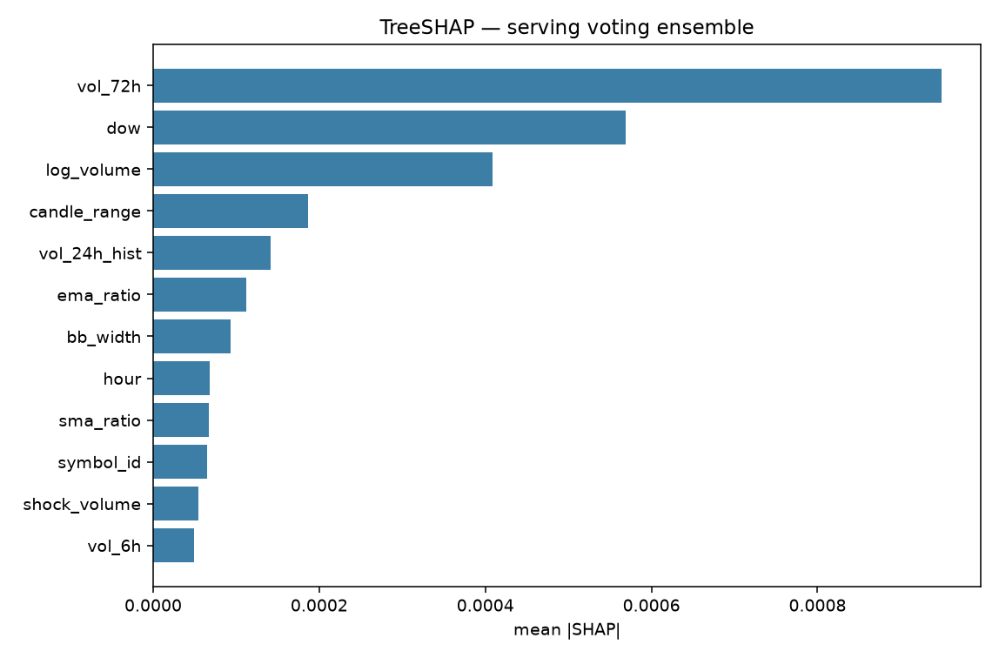

# TreeSHAP (Phase 3, proof only)

Attributions for the **serving** `models/model.joblib` voting ensemble. This is not a new model search. Walk-forward numbers stay in [EVALUATION.md](EVALUATION.md).

- Rows explained: **1500** (sample from the last 180 days)
- Method: TreeSHAP averaged across voting members
- Members: lgbm, xgb, rf
- Share from vol-family features (`vol_6h`, `vol_24h_hist`, `vol_72h`, `vol_term_structure`, `abs_return`, `bb_width`): **43.9%**

| Rank | Feature | mean \|SHAP\| | Share |
|---|---|---|---|
| 1 | `vol_72h` | 0.000949 | 32.7% |
| 2 | `dow` | 0.000569 | 19.6% |
| 3 | `log_volume` | 0.000409 | 14.1% |
| 4 | `candle_range` | 0.000186 | 6.4% |
| 5 | `vol_24h_hist` | 0.000141 | 4.9% |
| 6 | `ema_ratio` | 0.000112 | 3.9% |
| 7 | `bb_width` | 0.000093 | 3.2% |
| 8 | `hour` | 0.000068 | 2.3% |
| 9 | `sma_ratio` | 0.000067 | 2.3% |
| 10 | `symbol_id` | 0.000065 | 2.2% |
| 11 | `shock_volume` | 0.000055 | 1.9% |
| 12 | `vol_6h` | 0.000049 | 1.7% |
| 13 | `vol_term_structure` | 0.000036 | 1.2% |
| 14 | `rsi_14` | 0.000030 | 1.0% |
| 15 | `trades_z` | 0.000022 | 0.8% |
| 16 | `bb_pct` | 0.000019 | 0.7% |
| 17 | `taker_buy_ratio` | 0.000014 | 0.5% |
| 18 | `volume_z` | 0.000009 | 0.3% |
| 19 | `abs_return` | 0.000007 | 0.3% |
| 20 | `log_return` | 0.000003 | 0.1% |

Vol clustering leads (`vol_72h`). Weekday seasonality (`dow`) and log volume also matter. Signed returns and RSI are small — this is a volatility model, not a price-direction toy.

Machine-readable source: `models/shap_importance.json`.
